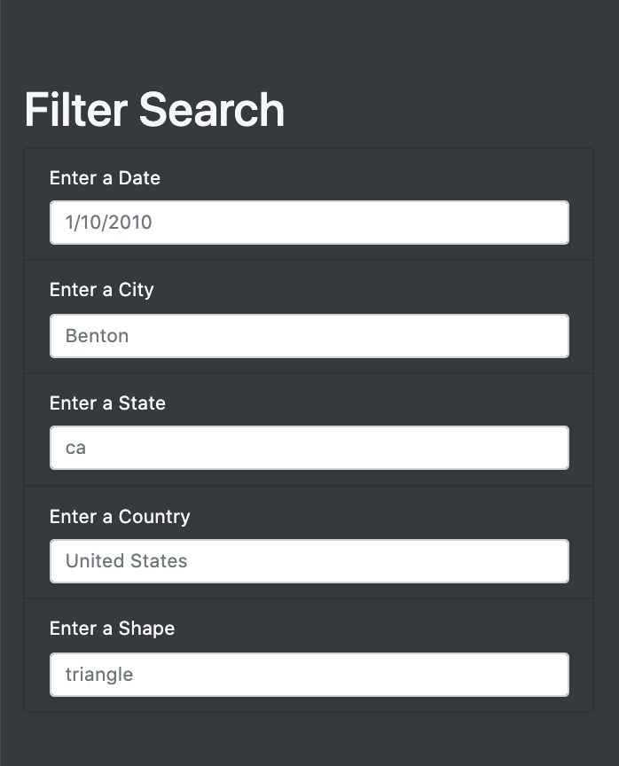

# UFOs

## Overview of the Analysis

The purpose of this analysis is to work with HTML, JavaScript, and Css to create a webpage that gives the reader information about UFO sightings that has taken place in the year 2010. I did this by connecting the HTML page with data about UFO sightings, building the charts of information through the JavaScript file, and stylizing the webpage with css. Readers can search up when and where the UFO sightings happened, the shape that they saw, the duration of the time they saw the UFO, and the comments they made about the visuals. 

## Results 

To navigate through the website, first read the title and the paragraph that goes the top of the page. It explains about the controversy of whether we are alone in this universe, or if there is extraterrestrial life out there. The question gives the reader curiosity to know more about the UFO sightings, which then leads to the reader being able to look at the data chart full of information about UFO sightings. The filter search bar on the left provides viewers the ability to focus in on specific dates and instances and filter through the data to be more specific. 

## Images

Title and Paragraph

Filter Search Bar

Data Results 

## Summary

One drawback about this new design is that the information about the sightings are only limited to the year 2010. I think that there should be more data about UFO Sightings that includes other years as well. Also in the future, there could be more visuals about UFO Sightings to make the page more visually appealing and interactive by adding more pictures or maybe a video of people being interviewed about UFO sightings. In addition, I think that the filter search section can be explained a bit better with a more detailed title and have it come with a set of instructions. 
